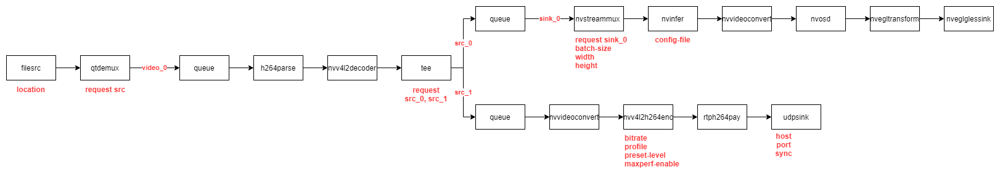

# gstreamer-c-api
some code examples for deepstream C API on Jetson Nano with DS 6.0

## Why?


Dependencies:

* GStreamer 1.14.5
* DeepStreamSDK 6.0.0
* JetPack 4.6 (SD-card boot)
* gcc (Ubuntu/Linaro 7.5.0-3ubuntu1~18.04) 7.5.0


# 1. **h264_gstreamer.c**

C-code  makes the same as:

```gst-launch-1.0 filesrc location = sample_720p.h264 ! h264parse ! nvv4l2decoder !  autovideosink sync=0```

**IMPORTANT: specify path to .h264 video**
 
to compile

```gcc h264_gstreamer.c -o h264_gstreamer `pkg-config --cflags --libs gstreamer-1.0` ```

to run

```./h264_gstreamer.c```

# 2. **test_video.c**

C-code  makes the same as:

```gst-launch-1.0 videotestsrc pattern=ball ! 'video/x-raw, format=(string)I420, width=(int)1920, height=(int)1080, framerate=(fraction)30/1' ! queue ! autovideosink sync=false```

**IMPORTANT: specify video resolution**

to compile

```gcc test_video.c -o test_video `pkg-config --cflags --libs gstreamer-1.0` ```

to run

```./test_video.c```


# 3. **udp_encoded_stream.c**

Not only Jetson board, but host PC too needed to run this code. Make sure there is Ethernet connections between them, IP adress of host should be 192.168.0.1, port 5000 should be open. Jetson should be in the same subnet, with IP 192.168.0.0. Host commands are from precompiled binaries, not using C API.

! Before starting, receiving code (on host) should be ran

```
gst-launch-1.0 udpsrc port=5000 caps = "application/x-rtp, media=(string)video,clock-rate=(int)90000, encoding-name=(string)H264, payload=(int)96" \
! rtph264depay ! decodebin ! videoconvert ! fpsdisplaysink sync=False
```


C-code  makes the same as:

``` ifconfig eth0 192.168.0.0 && \
gst-launch-1.0 videotestsrc pattern=ball ! 'video/x-raw, format=(string)I420, width=(int)1920, height=(int)1080, framerate=(fraction)30/1' ! \
! queue ! nvvideoconvert !  nvv4l2h264enc  bitrate=1000000 ! rtph264pay ! udpsink host=192.168.0.1 port=5000
```

to compile

```gcc udp_encoded_stream.c -o udp_encoded_stream `pkg-config --cflags --libs gstreamer-1.0` ```

to run (notice that there Jetson's IP-adress will be changed)

```sudo ifconfig eth0 192.168.0.0 && ./udp_encoded_stream```

# 4. **tee_encoded_stream.c**

Not only Jetson board, but host PC too needed to run this code. Make sure there is Ethernet connections between them, IP adress of host should be 192.168.0.1, port 5000 should be open. Jetson should be in the same subnet, with IP 192.168.0.0. Host commands are from precompiled binaries, not using C API.

In my application low latency and no freezes/artifacts are needed. So was chosen h264 "Main" profile (not ''Baseline'')

!Before starting, receiving code (on host) should be ran

```
gst-launch-1.0 udpsrc port=5000 caps = "application/x-rtp, media=(string)video,clock-rate=(int)90000, encoding-name=(string)H264, payload=(int)96" \
! rtph264depay ! decodebin ! videoconvert ! fpsdisplaysink sync=False
```


C-code  makes the same as:

``` 
gst-launch-1.0 videotestsrc pattern=ball ! 'video/x-raw, format=(string)I420, width=(int)1920, height=(int)1080, framerate=(fraction)30/1' ! tee name=t \
t. ! queue ! nvvideoconvert !  nvv4l2h264enc  bitrate=1000000 ! rtph264pay ! udpsink host=192.168.0.1 port=5000 \
t. ! queue !  autovideosink
```
to compile

```gcc tee_encoded_stream.c -o tee_encoded_stream `pkg-config --cflags --libs gstreamer-1.0 ` ```

to run (notice that there Jetson's IP-adress will be changed)

```sudo ifconfig eth0 192.168.0.0 && ./tee_encoded_stream```


# 5. Video as input, make inference & encoding at the same time

Not only Jetson board, but host PC too needed to run this code. Make sure there is Ethernet connections between them, IP adress of host should be 192.168.0.1, port 5000 should be open. Jetson should be in the same subnet, with IP 192.168.0.0. Host commands are from precompiled binaries, not using C API.

!Before starting, receiving code (on host) should be ran


```
gst-launch-1.0 udpsrc port=5000 caps = "application/x-rtp, media=(string)video,clock-rate=(int)90000, encoding-name=(string)H264, payload=(int)96" \
! rtph264depay ! decodebin ! videoconvert ! fpsdisplaysink sync=False
```
C-code makes the same as:



```
ifconfig eth0 192.168.0.0 && \
gst-launch-1.0 filesrc location = /opt/nvidia/deepstream/deepstream-6.0/samples/streams/sample_720p.h264 ! h264parse  ! nvv4l2decoder !  tee name=t \
t. ! queue ! m.sink_0 nvstreammux name = m \
batch-size=1 width=1920 height=1080 ! nvinfer config-file-path=dstest1_pgie_config.txt ! nvvideoconvert ! nvdsosd ! nvegltransform ! nveglglessink \
t. ! nvvideoconvert ! nvv4l2h264enc  bitrate=4000000 ! rtph264pay ! udpsink host=192.168.0.1 port=5000 sync=True
```

Because it's based on NVidia DeepStream example apps, compile it using Makefile
```
sudo make
```
to run (notice that there Jetson's IP-adress will be changed)

```
sudo ifconfig eth0 192.168.0.0 && ./deepstream-test1-app
```

# 6. CSI camera as input, make inference & encoding at the same time

This example is based on *deepstream_test4* sample applecation published by NVIDIA

Here I use Raspberry Camera HQ with sensor IMX477 via CSI connection. 

Before start working, run as superuser python script in ``/opt/nvidia/jetson_io/``` directory to configure drivers.

```
gst-launch-1.0 nvarguscamerasrc sensor-id=0 bufapi-version=1 ! "video/x-raw(memory:NVMM),width=1920,height=1080,format=(string)NV12,framerate=60/1" ! tee name=t \
t. ! queue ! m.sink_0 nvstreammux name = m \
batch-size=1 width=1920 height=1080  batched-push-timeout=33 num-surfaces-per-frame=1 ! nvinfer config-file-path=dstest1_pgie_config.txt ! nvvideoconvert ! nvdsosd ! nvegltransform ! nveglglessink sync=False \
t. ! nvvideoconvert ! nvv4l2h264enc  bitrate=4000000 ! rtph264pay ! udpsink host=192.168.0.1 port=5000 sync=True
```


# 7. CSI camera as input, make inference & encoding & send metadata to server at the same time

This example is based on *deepstream_test4* sample applecation published by NVIDIA

I configure AMQP server on host PC, using RabbitMQ (Erlang based) and GUI (according to simple instructions on official site)

Deepstream pipeline looks like:


Different configuring files are used there:
- **cfg_amqp.txt** - broker settings
- **dstest1_pgie_config.txt** - inference settings
- **dstest4_msgconv_config.txt** - metadata settings

Main connection schema looks like:


RabbitMQ settings:
- create queue named **modem_queue** with durable=YES and autodelete=FALSE
- link that queue to new exchange named **modem_exchange** with routing key **modem**
- wait for connecting :)
- P.S. You must can ping jetson from host PC and must be able to send cimple python commands from jetson to host (using PIKA library)

I use SimpleRabbitmqClient (C++) over rammitmq-c (C) as consumer on host side.

# 8. CSI camera as input, make inference & encoding & send custom metadata to custom & video saving from server command at the same time 

Main part in 8.4 directory

Runs datections & metadata sending at 30 FPS, encoded video also 30 FPS

UART support is in directory 8.5


# Tips

Don't use ```gst_caps_new_simple```, but ```gst_caps_from_string```
